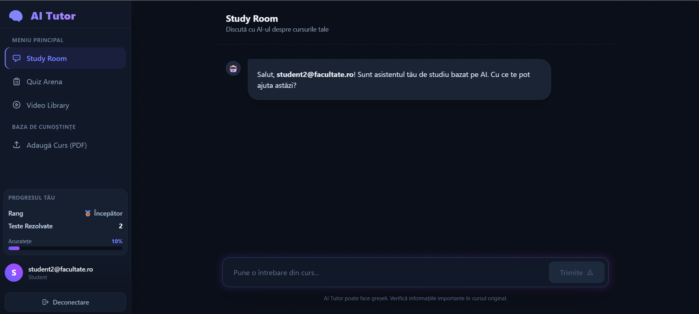
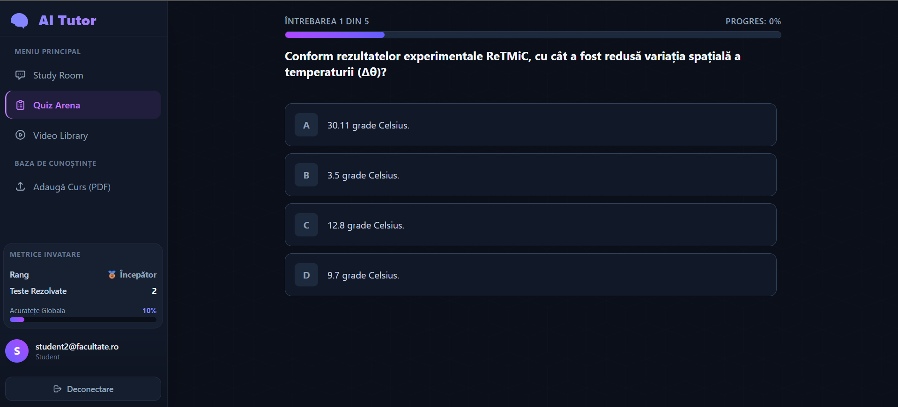
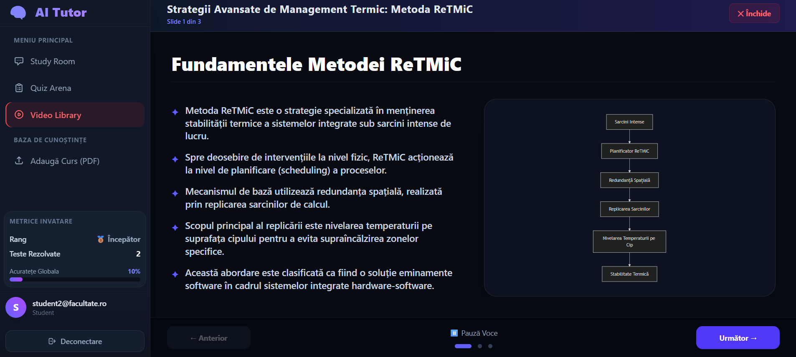

# 🧠 AI Tutor - Platformă Educațională Inteligentă (Proiect de Licență)

O aplicație web interactivă și modernă care transformă cursurile statice (PDF) în experiențe de învățare personalizate folosind Inteligența Artificială. Platforma integrează tehnologii de tip RAG (Retrieval-Augmented Generation), generare de imagini, diagrame dinamice și sinteză vocală (TTS) pentru a simula un profesor personal.

## ✨ Funcționalități Principale

* 📚 **Bază de Cunoștințe (RAG):** Încărcare de cursuri în format PDF, extragerea textului, chunking și stocare sub formă de vectori (Embeddings) pentru regăsire semantică.
* 💬 **Study Room:** Un asistent conversațional (Chatbot) care răspunde la întrebări bazându-se **strict** pe materia încărcată, incluzând referințe exacte și un sistem de *Fact-Checking* pentru prevenirea halucinațiilor AI.
* 🎯 **Quiz Arena:** Generare automată de teste grilă direct din contextul cursurilor. Include un sistem de gamificare cu ranguri (Începător, Explorator, Maestru) bazat pe acuratețea răspunsurilor.
* 🎬 **Video Library (Prezentări Interactive):** Transformă un subiect din curs într-o prezentare vizuală. Generează automat:
    * Structura de slide-uri (Idei principale).
    * Ilustrații educaționale (NVIDIA NIM - Stable Diffusion 3).
    * Diagrame și scheme logice (Mermaid.js).
    * Explicații vocale sincronizate (Edge-TTS).

## 🛠️ Arhitectură și Tehnologii (Tech Stack)

Sistemul este împărțit într-o arhitectură Client-Server decuplată:

**Frontend (Client):**
* **React.js** - Interfață interactivă (SPA - Single Page Application).
* **Tailwind CSS** - Stilzare modernă (Glassmorphism, animații fluide).
* **Mermaid.js** - Randare de diagrame direct din cod.

**Backend (Server):**
* **Python & FastAPI** - API rapid și asincron pentru gestionarea cererilor.
* **LangChain** - Orchestrarea pipeline-ului RAG și a interacțiunilor LLM.
* **Google Gemini (Flash)** - Modelul principal de limbaj (LLM) pentru raționament și generare text/JSON.
* **NVIDIA NIM API** - Generare de asset-uri vizuale complexe (Stable Diffusion).
* **HuggingFace Embeddings** - Modelul `paraphrase-multilingual-MiniLM-L12-v2` pentru vectorizarea limbii române.
* **Edge-TTS** - Generare fișiere audio (voce neuronală).

**Bază de Date:**
* **Supabase (PostgreSQL cu pgvector)** - Stocarea utilizatorilor (Auth), a progresului și a vectorilor textuali.

## 🚀 Instalare și Rulare Locală

### 1. Clonarea repository-ului
```bash
git clone https://github.com/TigauGabriel/Licenta
cd Licenta

### 2. Configurarea Variabilelor de Mediu (`.env`)
Creează un fișier `.env` în rădăcina proiectului backend și adaugă următoarele chei:
```env
SUPABASE_URL="url_ul_tau_supabase"
SUPABASE_KEY="cheia_ta_anon_sau_service"
GOOGLE_API_KEY="cheia_ta_gemini"
NVIDIA_API_KEY="cheia_ta_nvidia"
```

### 3. Pornirea Serverului Backend (FastAPI)
Deschide un terminal în folderul backend-ului:
```bash
# Crearea unui mediu virtual (opțional, dar recomandat)
python -m venv venv
source venv/bin/activate  # pe Windows: venv\Scripts\activate

# Instalarea dependențelor
pip install -r requirements.txt

# Pornirea serverului
python main.py
```
*Serverul va rula pe `http://localhost:8000`*

### 4. Pornirea Aplicației Frontend (React)
Deschide un alt terminal în folderul frontend-ului:
```bash
# Instalarea pachetelor NPM
npm install

# Pornirea aplicației în modul de dezvoltare
npm run dev
```
*Aplicația va fi accesibilă la `http://localhost:5173`*

## 📸 Capturi de Ecran




